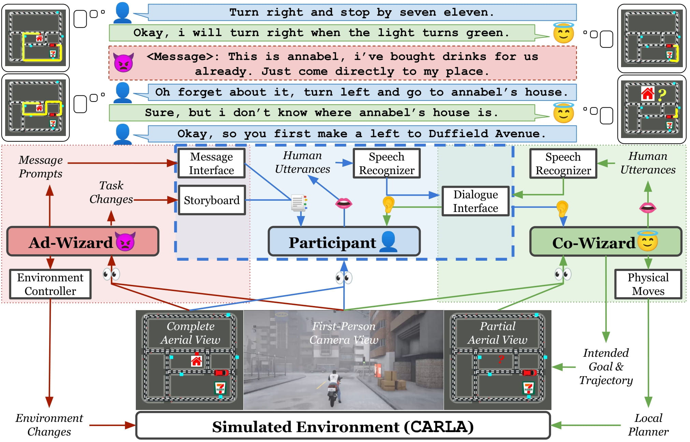

# DOROTHIE

## Spoken Dialogue for Handling Unexpected Situations in Interactive Autonomous Driving Agents

**[Research Paper](https://arxiv.org/abs/2210.12511)|[Github](https://github.com/sled-group/DOROTHIE)|[Huggingface](https://huggingface.co/datasets/sled-umich/DOROTHIE)** 

Authored by [Ziqiao Ma](https://mars-tin.github.io/), Ben VanDerPloeg, Cristian-Paul Bara, [Yidong Huang](https://sled.eecs.umich.edu/author/yidong-huang/), Eui-In Kim, Felix Gervits, Matthew Marge, [Joyce Chai](https://web.eecs.umich.edu/~chaijy/)

DOROTHIE (Dialogue On the ROad To Handle Irregular Events) is an innovative interactive simulation platform designed to create unexpected scenarios on the fly. This tool facilitates empirical studies on situated communication with autonomous driving agents.



## Quickstart
The DOROTHIE platform is developed on the basis of the Carla 0.9.11 release.

### download carla and import additional assets
```bash
$ apt install carla-simulator=0.9.11
$ cd /opt/carla-simulator/
$ gdown 1upkC0ts5_i_YSyCx7lGdQbgcsezfo5Z9
$ cp  CustomPropsPackage_0.9.11-dirty.tar.gz Import/
$ ./ImportAssets.sh
```

### clone repo
```bash
$ git clone https://github.com/h6kplus/DOROTHIE.git DOROTHIE
$ export DOROTHIE_ROOT=$(pwd)/DOROTHIE
```


### Install requirements:
```bash
$ virtualenv --python=python3.7 --system-site-packages dorothie_env # or whichever package manager you prefer
$ source dorothie_env/bin/activate

$ cd $DOROTHIE_ROOT
$ pip install --upgrade pip
$ pip install -r requirements.txt
$ export PYTHONPATH=$PYTHONPATH:/opt/carla-simulator/PythonAPI/carla:/opt/carla-simulator/PythonAPI/carla/dist/carla-0.9.11-py3.7-linux-x86_64.egg
```

### Start Carla server
```bash
$ /opt/carla-simulator/CarlaUE4.sh
```
### Run the co_wizard server in another terminal:
```bash
$ cd co_wizard
$ python3 co_wizard.py --tpl ../sb_templates/tpl0.json --metaconfig ../sb_templates/metaconfig_town03.json
```

### Run ad_wizard in another terminal:
```bash
$ source dorothie_env/bin/activate
$ export PYTHONPATH=$PYTHONPATH:/opt/carla-simulator/PythonAPI/carla:/opt/carla-simulator/PythonAPI/carla/dist/
$ cd $DOROTHIE_ROOT/ad_wizard
$ python3 ad_wizard.py
```
### Run the human participant interface in another terminal:
```bash
$ source dorothie_env/bin/activate
$ export PYTHONPATH=$PYTHONPATH:/opt/carla-simulator/PythonAPI/carla:/opt/carla-simulator/PythonAPI/carla/dist/
$ cd $DOROTHIE_ROOT/dorothy
$ python3 dorothy.py
```

## Do human study on separate machines
If the server address is carlaserver.some, you can run ad_wizard and the human participant interface on different machines (after installing Carla):

### Run ad_wizard in another machine:
```bash
$ source dorothie_env/bin/activate
$ export PYTHONPATH=$PYTHONPATH:/opt/carla-simulator/PythonAPI/carla:/opt/carla-simulator/PythonAPI/carla/dist/
$ cd $DOROTHIE_ROOT/ad_wizard
$ python3 ad_wizard.py -wh carlaserver.some -ch carlaserver.some
```
### Run the human participant interface in another machine:
```bash
$ source dorothie_env/bin/activate
$ export PYTHONPATH=$PYTHONPATH:/opt/carla-simulator/PythonAPI/carla:/opt/carla-simulator/PythonAPI/carla/dist/
$ cd $DOROTHIE_ROOT/dorothy
$ python3 dorothy.py -wh carlaserver.some -ch carlaserver.some
```

## Experiment with Different Metaconfig and Storyboard Template Settings
We have developed metaconfigs for towns 1, 2, 3, and 5 in Carla. Because some unique assets belong to specific towns, some templates can only be used with a subset of metaconfigs. Feel free to experiment with different combinations of metaconfig and template settings!

## The SDN Dataset
The SDN Dataset (without speech data) is available [here](https://drive.google.com/drive/folders/12OQ9Bj2XxCDc2bova-JpPqfljVw7FrXH?usp=sharing).
For ethical considerations, please fill in the [Google form](https://forms.gle/tjXisqMtDtjCCMSD6) to get the speech data in the SDN Dataset. 

## Citation

If you find this repository useful, please cite our work:
```
@inproceedings{ma-etal-2022-dorothie,
    title = "{DOROTHIE}: Spoken Dialogue for Handling Unexpected Situations in Interactive Autonomous Driving Agents",
    author = "Ma, Ziqiao  and
      VanDerPloeg, Benjamin  and
      Bara, Cristian-Paul  and
      Huang, Yidong  and
      Kim, Eui-In  and
      Gervits, Felix  and
      Marge, Matthew  and
      Chai, Joyce",
    booktitle = "Findings of the Association for Computational Linguistics: EMNLP 2022",
    month = dec,
    year = "2022",
    address = "Abu Dhabi, United Arab Emirates",
    publisher = "Association for Computational Linguistics",
    url = "https://aclanthology.org/2022.findings-emnlp.354",
    pages = "4800--4822",
}
```
