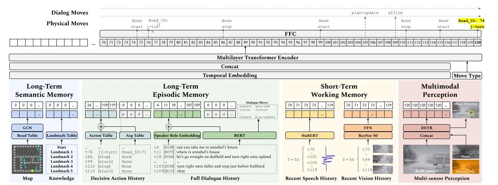

# Temporally-Ordered Task-Oriented (TOTO) Transformer

[<b>Spoken Dialogue for Handling Unexpected Situations in Interactive Autonomous Driving Agents](https://arxiv.org/abs/2210.12511) 

[Ziqiao Ma](https://maithub.io/), Ben VanDerPloeg, Cristian-Paul Bara, [Yidong Huang](https://sled.eecs.umich.edu/author/yidong-huang/), Eui-In Kim, Felix Gervits, Matthew Marge, [Joyce Chai](https://web.eecs.umich.edu/~chaijy/)

TOTO (Temporally-Ordered Task-Oriented
Transformer) is a novel transformer-based architecture and is task-oriented for all 3 tasks on the SDN benchmark collected using the [DOROTHIE](https://arxiv.org/abs/2210.12511) platform. To learn more about the original dataset and the original code, please refer to [DOROTHIE repository](https://github.com/sled-group/DOROTHIE)



## Quickstart

clone repo:
```bash
$ git clone git@github.com:Mars-tin/TOTO.git TOTO
$ export TOTO_ROOT=$(pwd)/TOTO
$ export PYTHONPATH=$PYTHONPATH:$TOTO_ROOT
```

Install requirements:
```bash
$ virtualenv -p $(which python3.7) toto_env
$ source toto_env/bin/activate

$ cd $TOTO_ROOT
$ pip install --upgrade pip
$ pip install -r requirements.txt
```

Download SDN dataset:

The SDN Dataset (without speech data) is available [here](https://drive.google.com/drive/folders/12OQ9Bj2XxCDc2bova-JpPqfljVw7FrXH?usp=sharing).
For ethical considerations, please fill in the [Google form](https://forms.gle/tjXisqMtDtjCCMSD6) to get the speech data in the SDN Dataset. 
Upon approval, you will get a file called SDN.tar.gz.
Then we can extract the dataset:
```bash
$ tar -xzvf SDN.tar.gz
```
The explanation of dataset structure is [here](SDN.md)


Preprocess the dataset (Optional):

```bash
$ python prep_dataset.py
```
This command generates **event_emb.pkl**, which is all you need for training validating and testing.

Run training and ablation study:

```bash
$ python train.py --ablation 0 --seed 0
```

Ablation 0 is the original TOTO architecture, you can try other ablation index or random seed.


## Citation

If you find this repository useful, please cite our work:
```
@inproceedings{ma-etal-2022-dorothie,
    title = "{DOROTHIE}: Spoken Dialogue for Handling Unexpected Situations in Interactive Autonomous Driving Agents",
    author = "Ma, Ziqiao  and
      VanDerPloeg, Benjamin  and
      Bara, Cristian-Paul  and
      Huang, Yidong  and
      Kim, Eui-In  and
      Gervits, Felix  and
      Marge, Matthew  and
      Chai, Joyce",
    booktitle = "Findings of the Association for Computational Linguistics: EMNLP 2022",
    month = dec,
    year = "2022",
    address = "Abu Dhabi, United Arab Emirates",
    publisher = "Association for Computational Linguistics",
    url = "https://aclanthology.org/2022.findings-emnlp.354",
    pages = "4800--4822",
}
```
